# 予約サイト横断同期

## 1. イメージ

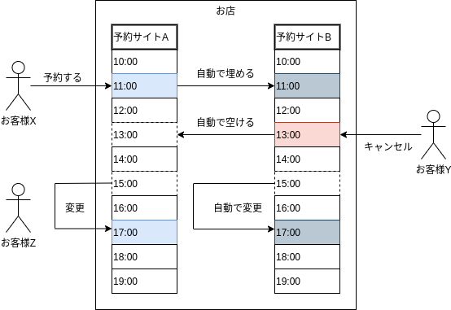

---

## 2. 概要

お店やってる友人用です。  
予約が入るたびに、手動で別のサイトの同じ時間を埋めていたので、「地味に面倒だな…」と思った次第。  
現在、対応しているのは友人の持ってる２サイトのみ。  
友人用なので、適切な設定値を設定しないと動きません。  

---

## 3. セットアップ

- ### 3-1. バックエンド

  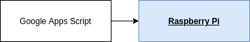

  ```
  SERVICE_ID=<サービスID>
  ```

  ```
  docker build --network host -t ${SERVICE_ID} .
  ```

  ```
  docker run --network host --name ${SERVICE_ID} -d -p 8080:8080 ${SERVICE_ID}
  ```

- ### 3-2. GAS

  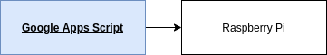

  ※予約サイトからの通知を GMail で受信するようになっていないと、動きません。

  - ### 3-2-1. Google Apps Script を作る

    ファイル名は何でもいいです。

    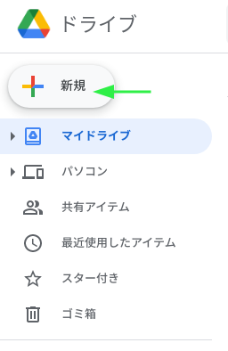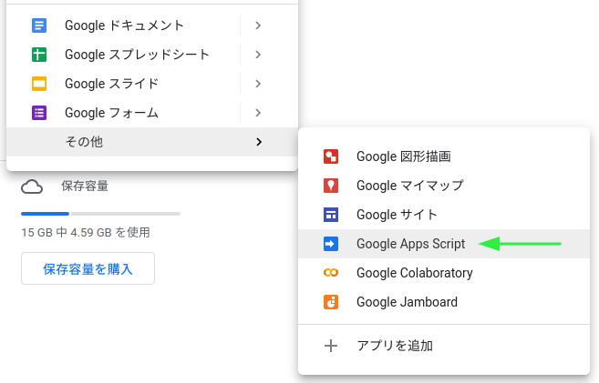

  - ### 3-2-2. `salon-reserve-sync.gs` の内容を、3-2-1. で作った Google Drive 上のファイルにコピペする

    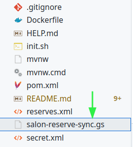

  - ### 3-2-3. エンドポイントを書き換える

    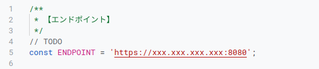

    1 - グローバルIPを設定。

    2 - ルーターのポート（8080）を開放し、ポートフォワードを設定。

    3 - ファイアウォールも 8080 を開ける。

  - ### 3-2-4. ログイン

    実行する関数を `login` に設定し、「実行」をクリック。

    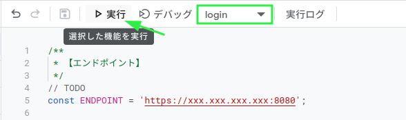

  - ### 3-2-5. トリガーの設定

    受信した GMail の監視設定を行います。

    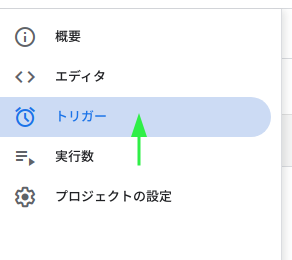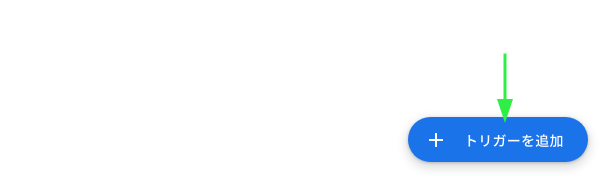

    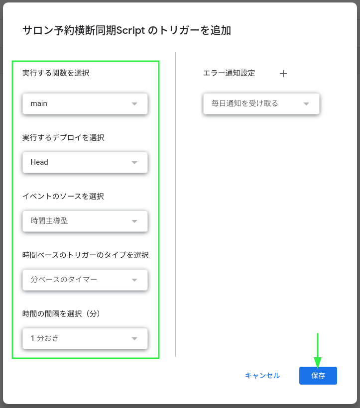

---

## 4. シーケンス

  - ### 4-1. ログイン

    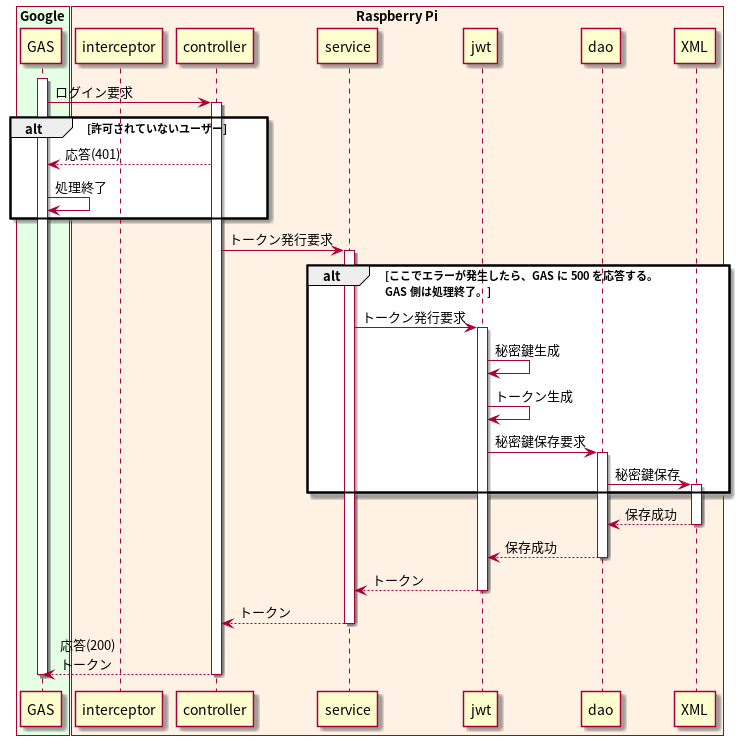

  - ### 4-2. 同期

    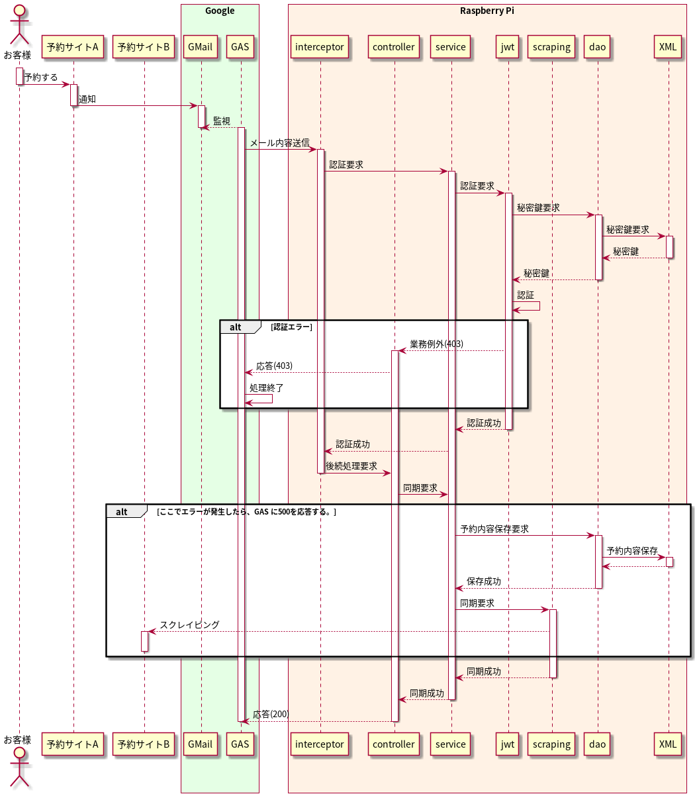
